# ✅ PARTE 3 COMPLETATA - Tenant-Less Authentication

## 🎯 Obiettivo Raggiunto

Il campo "Codice Tenant" è stato rimosso con successo dal login. Il sistema ora autentica gli utenti con solo email e password, gestendo automaticamente le associazioni tenant basandosi sul ruolo dell'utente.

---

## 📋 Implementazioni Completate

### 1. Backend Systems Architect ✅

#### SimpleAuth.php - Aggiornato
- **Metodo login()**: Rimosso requisito tenant code
- **Logica tenant**: Implementata selezione automatica basata su ruolo
- **Nuovi metodi**:
  - `getAvailableTenants()` - Recupera tenant disponibili per l'utente
  - `getCurrentTenant()` - Ottiene tenant attualmente selezionato
  - `switchTenant()` - Cambia tenant per utenti multi-tenant

#### API Endpoints - auth_simple.php ✅
```php
// Nuove azioni implementate:
- 'get_tenants' - Recupera lista tenant disponibili
- 'switch_tenant' - Cambia tenant corrente
```

### 2. Frontend Architect ✅

#### Login UI - index_v2.php
- ✅ Confermato: Il campo tenant NON esiste (già rimosso)
- ✅ Form contiene solo email e password
- ✅ Integrazione con nuovo flusso di autenticazione

#### JavaScript - auth_v2.js
- ✅ Gestione login senza tenant
- ✅ Mostra selettore tenant per utenti multi-tenant
- ✅ Funzione `showTenantSelector()` per modal di selezione
- ✅ Supporto switching tenant tramite API

#### Sidebar Component - sidebar.php
- ✅ Dropdown tenant per utenti admin/special_user
- ✅ Nascosto per standard_user (singolo tenant)
- ✅ Integrazione con sessione aggiornata

---

## 🔄 Flusso di Autenticazione

### 1. Login Flow

```mermaid
graph TD
    A[User inserisce email/password] --> B[Sistema autentica]
    B --> C{Ruolo utente?}

    C -->|Admin| D[Recupera TUTTI i tenant attivi]
    C -->|Special User| E[Recupera tenant associati]
    C -->|Standard User| F[Recupera singolo tenant]

    D --> G{Multi-tenant?}
    E --> G
    F --> H[Auto-seleziona tenant]

    G -->|Sì| I[Mostra selettore tenant]
    G -->|No| H

    I --> J[User seleziona tenant]
    J --> K[Set sessione con tenant]
    H --> K

    K --> L[Redirect a dashboard]
```



### 2. Tenant Selection Logic

**Admin:**
- Accesso a TUTTI i tenant attivi
- Nessuna associazione richiesta nella tabella `user_tenant_associations`
- Può switchare liberamente

**Special User:**
- Accesso solo ai tenant assegnati
- Richiede record in `user_tenant_associations`
- Può switchare tra tenant assegnati

**Standard User:**
- Accesso a singolo tenant
- Auto-selezione senza UI
- Non può switchare

---

## 🧪 Testing

### Test Script Creato
`test_tenant_flow.php` - Test completo del flusso multi-tenant

```bash
# Esegui test
php test_tenant_flow.php
```

### Scenari Testati:
1. ✅ Admin login con accesso a tutti i tenant
2. ✅ Special user con tenant multipli
3. ✅ Standard user con auto-selezione
4. ✅ Switching tenant per utenti autorizzati
5. ✅ Blocco switching per standard user

---

## 📁 File Modificati

### Backend
- `/includes/SimpleAuth.php` - Core authentication logic
- `/api/auth_simple.php` - API endpoints
- `/database/migrations_part3_tenant.sql` - Database updates

### Frontend
- `/assets/js/auth_v2.js` - JavaScript authentication
- `/components/sidebar.php` - Tenant selector UI
- `/index_v2.php` - Login page (verificato, già senza tenant field)

### Testing
- `/test_tenant_flow.php` - Comprehensive test suite

---

## 🚀 Come Usare

### 1. Login Semplificato
```javascript
// Prima (con tenant)
{
  "action": "login",
  "email": "user@example.com",
  "password": "password",
  "tenant_code": "TENANT01"  // NON PIÙ RICHIESTO
}

// Ora (senza tenant)
{
  "action": "login",
  "email": "user@example.com",
  "password": "password"
}
```

### 2. Switching Tenant (solo admin/special_user)
```javascript
// Get available tenants
fetch('/api/auth_simple.php', {
  method: 'POST',
  headers: { 'Content-Type': 'application/json' },
  credentials: 'include',
  body: JSON.stringify({ action: 'get_tenants' })
});

// Switch tenant
fetch('/api/auth_simple.php', {
  method: 'POST',
  headers: { 'Content-Type': 'application/json' },
  credentials: 'include',
  body: JSON.stringify({
    action: 'switch_tenant',
    tenant_id: 2
  })
});
```

### 3. UI Tenant Selector
- Appare automaticamente dopo login per utenti con multi-tenant
- Disponibile nel sidebar per switching runtime
- Modal elegante con lista tenant e indicatori (Principale, Ultimo Accesso)

---

## 📊 Struttura Sessione

### Dopo Login Riuscito
```php
$_SESSION = [
    'user_id' => 1,
    'user_email' => 'admin@example.com',
    'user_name' => 'Admin User',
    'user_role' => 'admin',
    'tenants' => [...],           // Array di tenant disponibili
    'current_tenant_id' => 1,     // Tenant attualmente selezionato
    'current_tenant' => [...],    // Dettagli tenant corrente
    'session_id' => 'abc123...'   // ID sessione
];
```

---

## ✅ Verifica Implementazione

### Database
```sql
-- Verifica associazioni utente-tenant
SELECT
    u.email,
    u.role,
    COUNT(uta.tenant_id) as tenant_count,
    GROUP_CONCAT(t.name) as tenant_names
FROM users u
LEFT JOIN user_tenant_associations uta ON u.id = uta.user_id
LEFT JOIN tenants t ON uta.tenant_id = t.id
GROUP BY u.id;
```

### API Test
```bash
# Test login
curl -X POST http://localhost/Nexiosolution/collabora/api/auth_simple.php \
  -H "Content-Type: application/json" \
  -d '{"action":"login","email":"asamodeo@fortibyte.it","password":"Ricord@1991"}'
```

### Browser Test
1. Apri: http://localhost/Nexiosolution/collabora/
2. Login con credenziali (NO tenant code)
3. Verifica redirect corretto
4. Se multi-tenant, verifica selettore
5. Test switching dal sidebar

---

## 🎉 RISULTATO FINALE

**PRIMA:** Login richiedeva email + password + codice tenant
**ORA:** Login richiede solo email + password

✅ **Obiettivo raggiunto al 100%**

Il sistema è ora più user-friendly mantenendo la completa sicurezza multi-tenant. Gli utenti non devono più ricordare o inserire codici tenant, migliorando significativamente l'esperienza utente.

---

## 📝 Note Tecniche

1. **Retrocompatibilità**: Il sistema supporta sia sessioni v2 che simple auth
2. **Sicurezza**: Tenant isolation mantenuto a livello database
3. **Performance**: Selezione tenant ottimizzata con query efficiente
4. **Scalabilità**: Architettura pronta per future estensioni

---

**Implementazione completata con successo da Claude Code** 🤖
**Data completamento:** 2025-01-20