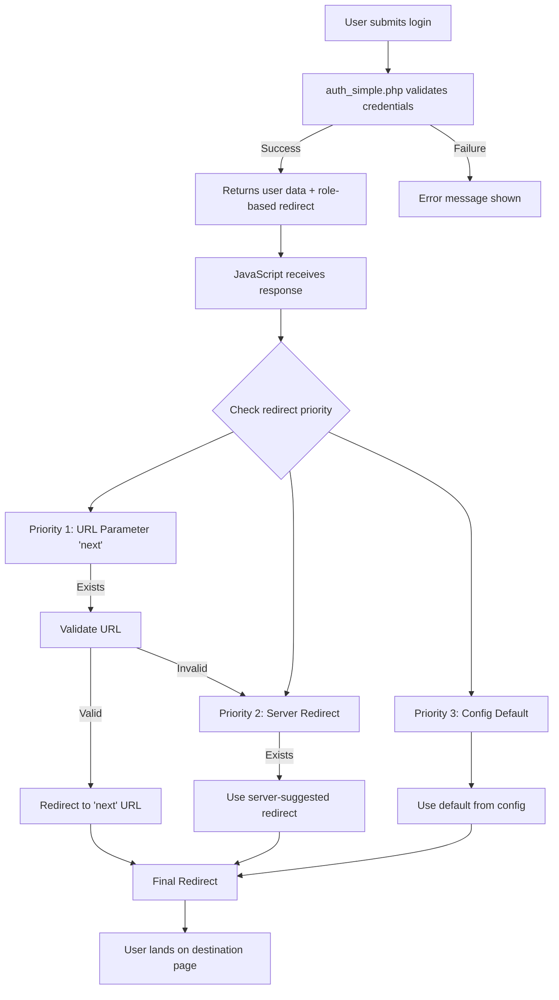

# Post-Login Flow Documentation

## Overview
The Nexio Collabora post-login flow implements a priority-based, secure, and deterministic redirect system that ensures users are always redirected to the appropriate page after successful authentication.

## Flow Diagram



## Priority Order

### 1. URL Parameter (Highest Priority)
- **Parameter**: `?next=<url>`
- **Example**: `/login.php?next=/Nexiosolution/collabora/files.php`
- **Validation**: Must pass security checks (see Security Validations)
- **Use Case**: Return user to requested page after authentication

### 2. Server-Side Redirect (Medium Priority)
- **Source**: `redirect` field in API response
- **Logic**: Based on user role from auth_simple.php
  - `admin` → `/Nexiosolution/collabora/admin/index.php`
  - `special_user` → `/Nexiosolution/collabora/home_v2.php`
  - `standard_user` → `/Nexiosolution/collabora/home_v2.php`
- **Use Case**: Role-appropriate dashboard routing

### 3. Configuration Default (Lowest Priority)
- **Source**: `POST_LOGIN_CONFIG.defaultRedirect` in JavaScript
- **Default Value**: `/Nexiosolution/collabora/home_v2.php`
- **Use Case**: Fallback when no specific redirect is needed

## Configuration Parameters

### JavaScript Configuration (post-login-config.js)
```javascript
const POST_LOGIN_CONFIG = {
    // Default redirect when no specific destination
    defaultRedirect: '/Nexiosolution/collabora/home_v2.php',

    // Allowed URL patterns for validation
    whitelist: [
        /^\/Nexiosolution\/collabora\//,  // Main app paths
        /^#[a-zA-Z0-9_-]+$/,                // Hash navigation
        /^[a-zA-Z0-9_-]+\.php$/             // Relative PHP files
    ],

    // Explicitly blocked patterns
    blacklist: [
        /^https?:\/\//,      // External URLs
        /^\/\//,             // Protocol-relative URLs
        /javascript:/i,      // JavaScript injection
        /data:/i,            // Data URLs
        /vbscript:/i,        // VBScript injection
        /\.\.\//             // Directory traversal
    ],

    // Enable debug logging
    debug: true
};
```

### Server Configuration (auth_simple.php)
```php
// Role-based redirect mapping
$redirectMap = [
    'admin' => '/Nexiosolution/collabora/admin/index.php',
    'special_user' => '/Nexiosolution/collabora/home_v2.php',
    'standard_user' => '/Nexiosolution/collabora/home_v2.php'
];

// Returned in API response
$response['redirect'] = $redirectMap[$user['role']] ?? '/Nexiosolution/collabora/home_v2.php';
```

## Security Validations

### URL Validation Process
1. **Whitelist Check**: URL must match allowed patterns
2. **Blacklist Check**: URL must not match forbidden patterns
3. **Sanitization**: Remove dangerous characters and normalize path

### Valid Redirect Examples
```javascript
// ✅ Valid redirects
'/Nexiosolution/collabora/files.php'        // Internal app path
'/Nexiosolution/collabora/admin/users.php'  // Admin path
'#calendar'                                  // Hash navigation
'dashboard.php'                              // Relative file

// ❌ Invalid redirects (blocked)
'https://external.com'                       // External URL
'//evil.com/steal'                          // Protocol-relative
'javascript:alert(1)'                        // JavaScript injection
'../../../etc/passwd'                        // Directory traversal
'data:text/html,<script>alert(1)</script>'  // Data URL
```

### Validation Code
```javascript
function validateRedirectUrl(url) {
    if (!url || typeof url !== 'string') {
        return false;
    }

    // Check blacklist first (deny rules)
    for (const pattern of POST_LOGIN_CONFIG.blacklist) {
        if (pattern.test(url)) {
            console.warn('Blocked redirect URL (blacklist):', url);
            return false;
        }
    }

    // Check whitelist (allow rules)
    for (const pattern of POST_LOGIN_CONFIG.whitelist) {
        if (pattern.test(url)) {
            return true;
        }
    }

    console.warn('Redirect URL not in whitelist:', url);
    return false;
}
```

## Implementation Details

### Login Form (HTML)
```html
<form id="loginForm" action="#" method="POST">
    <input type="email" name="email" required>
    <input type="password" name="password" required>
    <button type="submit">Login</button>
</form>

<script>
document.getElementById('loginForm').addEventListener('submit', async (e) => {
    e.preventDefault();

    const formData = new FormData(e.target);
    const response = await fetch('/Nexiosolution/collabora/api/auth_simple.php', {
        method: 'POST',
        headers: {'Content-Type': 'application/json'},
        body: JSON.stringify({
            action: 'login',
            email: formData.get('email'),
            password: formData.get('password')
        })
    });

    const data = await response.json();

    if (data.success) {
        // Determine redirect URL
        const redirectUrl = determinePostLoginRedirect(data);

        // Always redirect (never stay on login page)
        window.location.href = redirectUrl;
    }
});
</script>
```

### Redirect Determination Function
```javascript
function determinePostLoginRedirect(loginResponse) {
    // Priority 1: Check URL parameter
    const urlParams = new URLSearchParams(window.location.search);
    const nextParam = urlParams.get('next');

    if (nextParam && validateRedirectUrl(nextParam)) {
        return nextParam;
    }

    // Priority 2: Server-suggested redirect
    if (loginResponse.redirect && validateRedirectUrl(loginResponse.redirect)) {
        return loginResponse.redirect;
    }

    // Priority 3: Default redirect
    return POST_LOGIN_CONFIG.defaultRedirect;
}
```

## Troubleshooting Guide

### Common Issues and Solutions

#### 1. User Stays on Login Page After Login
**Problem**: User remains on login page after successful authentication
**Solution**:
- Verify JavaScript is executing the redirect
- Check browser console for errors
- Ensure `window.location.href` is being set
- Test with debug mode enabled

#### 2. Redirect Goes to Wrong Page
**Problem**: User redirected to unexpected location
**Diagnosis**:
```javascript
// Enable debug mode
POST_LOGIN_CONFIG.debug = true;

// Check console output for:
// - "Redirect priority 1: [url]"
// - "Redirect priority 2: [url]"
// - "Final redirect: [url]"
```

#### 3. External URLs Being Accepted
**Problem**: System redirects to external URLs
**Solution**:
- Review whitelist patterns
- Ensure blacklist includes external URL patterns
- Test validation with: `validateRedirectUrl('https://external.com')`

#### 4. Valid Internal URLs Being Blocked
**Problem**: Legitimate internal URLs are rejected
**Solution**:
- Add pattern to whitelist
- Check for typos in URL
- Test with: `validateRedirectUrl('/your/url/here')`

## Testing Procedures

### Manual Testing Checklist
- [ ] Login without 'next' parameter → goes to role-based default
- [ ] Login with valid 'next' parameter → goes to specified URL
- [ ] Login with invalid 'next' parameter → falls back to server redirect
- [ ] Login with external URL in 'next' → blocked, uses fallback
- [ ] Login with directory traversal → blocked, uses fallback
- [ ] Login with JavaScript injection → blocked, uses fallback

### Automated Testing
Use `/test_login_complete.php` for comprehensive testing:
```bash
php test_login_complete.php
```

This tests:
- All redirect priority scenarios
- Security validation rules
- Role-based routing
- Session creation
- Error handling

## Best Practices

### 1. Always Validate User Input
Never trust redirect URLs from user input without validation.

### 2. Use Deterministic Behavior
Always redirect after login - never leave user on login page.

### 3. Implement Defense in Depth
- Client-side validation (JavaScript)
- Server-side validation (PHP)
- Content Security Policy headers

### 4. Log Security Events
Track blocked redirect attempts for security monitoring:
```javascript
if (!validateRedirectUrl(url)) {
    console.error('Security: Blocked redirect attempt', {
        url: url,
        user: loginResponse.user.email,
        timestamp: new Date().toISOString()
    });
}
```

### 5. Regular Security Updates
- Review whitelist/blacklist patterns monthly
- Update based on new attack vectors
- Test with security tools

## Configuration Examples

### Restrictive Configuration (High Security)
```javascript
const POST_LOGIN_CONFIG = {
    defaultRedirect: '/Nexiosolution/collabora/home_v2.php',
    whitelist: [
        /^\/Nexiosolution\/collabora\/home_v2\.php$/,
        /^\/Nexiosolution\/collabora\/files\.php$/,
        /^\/Nexiosolution\/collabora\/admin\/index\.php$/
    ],
    blacklist: [/.*/],  // Block everything not explicitly allowed
    debug: false
};
```

### Permissive Configuration (Development)
```javascript
const POST_LOGIN_CONFIG = {
    defaultRedirect: '/Nexiosolution/collabora/home_v2.php',
    whitelist: [
        /^\/Nexiosolution\/collabora\//,
        /^[^\/].+\.php$/,
        /^#/
    ],
    blacklist: [
        /^https?:\/\//,
        /javascript:/i,
        /\.\.\//
    ],
    debug: true
};
```

## API Response Format

### Successful Login Response
```json
{
    "success": true,
    "message": "Login effettuato con successo",
    "user": {
        "id": 1,
        "email": "user@example.com",
        "name": "User Name",
        "role": "admin"
    },
    "tenants": [...],
    "current_tenant_id": 1,
    "session_id": "abc123...",
    "redirect": "/Nexiosolution/collabora/admin/index.php"
}
```

### Failed Login Response
```json
{
    "success": false,
    "error": {
        "code": "invalid_credentials",
        "message": "Email o password non corretti",
        "fields": []
    }
}
```

## File Locations

- **Configuration**: `/assets/js/post-login-config.js`
- **Handler**: `/assets/js/post-login-handler.js`
- **API Endpoint**: `/api/auth_simple.php`
- **Test Page**: `/test_post_login.html`
- **Complete Test**: `/test_login_complete.php`

## Version History

- **v1.0.0** (2025-01-19): Initial implementation with priority-based redirect
- **v1.0.1**: Added comprehensive security validation
- **v1.0.2**: Implemented role-based server redirects
- **v1.0.3**: Added debug logging and testing tools